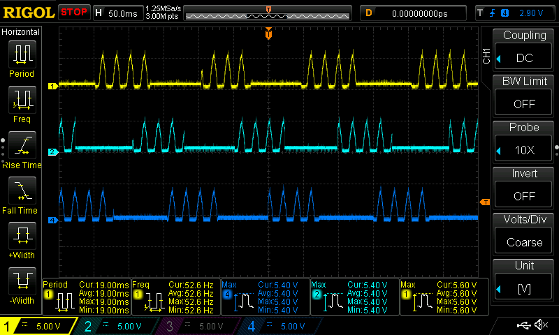
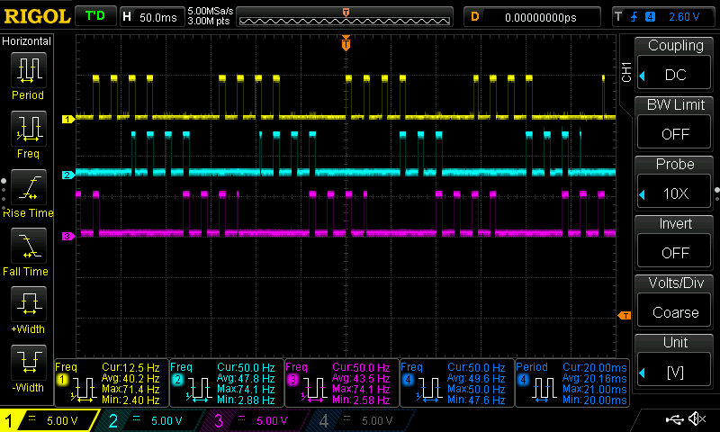

# FakeHall - Fake the hall signal of a hoverboard 

Fake the hall project is a testing toll for an other experiment where  I would 
like to hijack a hoverboard in a most simple way possible.  
It generates fake signal similar to original one, except this use square wave
signal instead of sinusoid one.

## Captured Hall Effect Sensor

## Fake the hall output

## Intro

